<div align="center">



<br/>
<br/>

<a href="https://www.linkedin.com/in/richard-carraro-66553430b/">
  
</a>

</div>

<br/>

```text
richard@curitiba
────────────────────────────────────────────────────────────
 Formação     Engenharia de Software (em andamento)
 Trabalho     Estagiário de TI · CRC-PR
              Conselho Regional de Contabilidade do Paraná
 Local        Curitiba — PR, Brasil (UTC-3)
 Foco         Desenvolvimento web · Banco de dados
 Status       sempre compilando algo novo
```

<br/>

## `$ cat stack.yml`

```yaml
linguagens:   [TypeScript, JavaScript, PHP, SQL]
frontend:     [React, Tailwind CSS, HTML, CSS]
backend:      [PHP, Node.js]
dados:        [MySQL, PostgreSQL]
ferramentas:  [Git, VS Code, Linux]
```

## `$ ls ~/projetos`

| repositório | descrição |
| :--- | :--- |
| [`DevPremium/`](https://github.com/RichardCarraro/DevPremium---Freelance-Web-Solutions) | Soluções web freelance com design premium |
| [`logos/`](https://github.com/RichardCarraro/logos) | Plataforma cristã gamificada — jogos de palavras e trilhas de estudo |

## `$ git log --stat`

<div align="center">
  


</div>

<br/>

<div align="center">

`richard@curitiba:~$ exit` — <sub>obrigado pela visita</sub>

</div>
